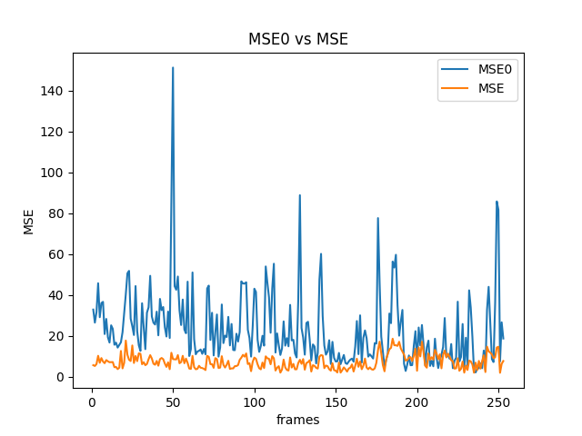

# 
 Deep Learning in Computer Vision   Lab 1 - Optical Flow estimation & Global motion estimation in the image plane with RANSAC algorithm
# 
Heurtel Thomas & Piet Thomas

## 1. MSE

    First MSE plot is from the video PersonConvergence_720.MOV with a delta of 1. 

    As we can see, the MSE0 curves is always above the MSE one. The values or really close and the curves are flat because of the small delta choose, and because there is not a lot of mouvement in the video.

    
    This is an exemple of motion estimation in the video PersonConvergence_720.MOV, where we can see the directional arrow where the feet is going. The values here are higher and the curves are not flat because the delta we choose is bigger and because there is more movement detected in the video.

##

    The second MSE plot is from the video v_Taichi_g16_c04.avi with a delta of 2.

    
    Here too, the MSE0 curve is almost all the time above the MSE one.

##

## 2. PSNR

    First PSNR plot is from the video PersonConvergence_720.MOV with a delta of 1.

    
    There, the PSNR curve is above the PSNR0 one.

##

    The second PSNR plot is from the video v_Taichi_g16_c04.avi with a delta of 2.

    Here, the curvesintersect many times, but on average curve PSNR is above curve PSNR0.

##

## 3. Entropy

    First Entropy plot is from the video PersonConvergence_720.MOV with a delta of 1. 

##

    The second Entropy plot is from the video v_Taichi_g16_c04.avi with a delta of 2.

    

##

